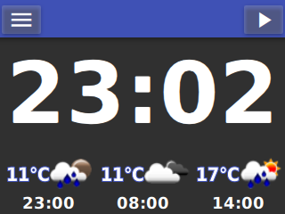
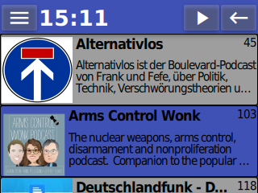
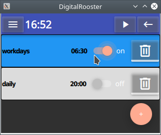
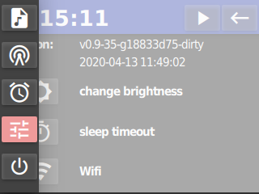

# DigitalRooster

Internet radio, podcast player and alarmclock. Intended to run on embedded
Linux with a small touch display.

This repository is part of a larger project. For more information head to
[www.digitalrooster.dev](https://www.digitalrooster.dev)

Microsoft Windows and Desktop GNU/Linux systems are supported for development.

## Some Screenshots

---
## License

Copyright (c) 2018 by Thomas Ruschival <thomas@ruschival.de>

    This program is free software: you can redistribute it and/or modify
    it under the terms of the GNU General Public License as published by
    the Free Software Foundation, either version 3 of the License, or
    (at your option) any later version.
    This program is distributed in the hope that it will be useful,
    but WITHOUT ANY WARRANTY; without even the implied warranty of
    MERCHANTABILITY or FITNESS FOR A PARTICULAR PURPOSE.

See the [GNU General Public License v3.0](./LICENSE) for more details.

SPDX-License-Identifier: GPL-3.0-or-later

### Third party work used in DigitalRooster

The icons of DigitalRooster use the font "materialdesignicons-webfont.ttf"

"Materialdesignicons-webfont" copyright (c) 2014, Austin Andrews
is licensed under [SIL Open Font License, Version 1.1.](http://scripts.sil.org/OFL)

The name ["Material Design Icons"](http://materialdesignicons.com/) is a
reserved font name, copyright (c) 2014 [Google](http://www.google.com/design/)
licensed under [Apache License Version 2.0](https://github.com/google/material-design-icons/blob/master/LICENSE)

Parts of QML in DigitalRooster are inspired by [Qmlbridgeformaterialfonts](https://github.com/kevincarlson/QmlBridgeForMaterialDesignIcons)
by Kevin Carlso licenced under the [SIL Open Font License, Version 1.1.](http://scripts.sil.org/OFL)

DigitalRooster uses ``include/wpa_ctrl/wpa_ctrl.h`` and ``wpa_ctrl/wpa_ctrl.c``
to interface with [wpa_supplicant](https://w1.fi/wpa_supplicant/)

Copyright (c) 2002-2018, Jouni Malinen <j@w1.fi> and contributors
licensed under BSD license.

``wpa_ctrl.c`` was modified with input from
[Holger Schurig](http://lists.shmoo.com/pipermail/hostap/2013-May/027826.html)

The fallback alarm sound "TempleBell" copyright (c) by Mike Koenig downloaded
from [www.soundbible.com](http://soundbible.com/1531-Temple-Bell.html)

"Temple Bell" is licensed under Creative Commons Attribution

All license texts can be found in the directory [licenses](licenses).

---

## Build configuration

On how to build the desktop version see [documentation/build.md](./documentation/build.md)
For information on how to build the embedded version see the project
[buildroot_digitalrooster](https://github.com/truschival/buildroot_digitalrooster)
and [www.digitalrooster.dev](https://www.digitalrooster.dev)

---

## Runtime configuration

DigitalRooster as a range of options to configure the program behavior,
default paths etc. For detailed description see
[documentation/configuration.md](./documentation/configuration.md)

---
