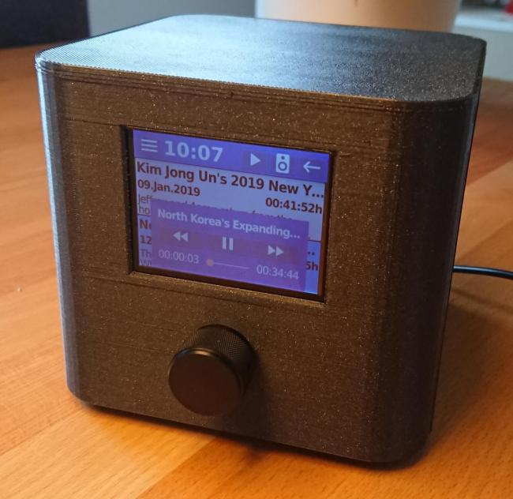

[](https://www.gnu.org/licenses/gpl-3.0)
[](https://travis-ci.com/truschival/DigitalRoosterGui)
[](https://codecov.io/gh/truschival/DigitalRoosterGui)
[](https://www.codacy.com/app/truschival/DigitalRoosterGui)

# DigitalRooster

Internet radio, podcast player and alarmclock. Intended to run on embedded Linux with a small touch display. Microsoft Windows and Desktop GNU/Linux systems are supported for development.




## Some Screenshots


---
## License

Copyright (c) 2018 by Thomas Ruschival <thomas@ruschival.de>

Licensed under [GNU General Public License v3.0](http://www.gnu.org/licenses/gpl-3.0-standalone.html)

SPDX-License-Identifier: GPL-3.0-or-later

DigitalRooster uses [Qmlbridgeformaterialfonts](https://github.com/kevincarlson/QmlBridgeForMaterialDesignIcons)
software by Kevin Carlso licenced under the [SIL Open Font License, Version 1.1.](http://scripts.sil.org/OFL)
QmlBridgeForMaterialDesignIcons uses the True Type Font "materialdesignicons-webfont.ttf"

The font materialdesignicons-webfont.ttf is licensed under [SIL Open Font License, Version 1.1.](http://scripts.sil.org/OFL) -
Copyright (c) 2014, Austin Andrews

The Name [Material Design Icons](http://materialdesignicons.com/) is a reserved Font Name.
Copyright (c) 2014, [Google] (http://www.google.com/design/) licensed under
[Apache License Version 2.0](https://github.com/google/material-design-icons/blob/master/LICENSE)

DigitalRooster uses ``include/wpa_ctrl/wpa_ctrl.h`` and ``wpa_ctrl/wpa_ctrl.c`` to interface with
[wpa_supplicant](https://w1.fi/wpa_supplicant/)
Copyright (c) 2002-2018, Jouni Malinen <j@w1.fi> and contributors licensed under BSD license.
``wpa_ctrl.c`` was modified with input from
[Holger Schurig](http://lists.shmoo.com/pipermail/hostap/2013-May/027826.html)

All license details can be found in the file LICENSE

---

## Build configuration

### Options & Defaults (compilation flags & targets)

- `-DBUILD_TESTS=On`           build unit tests
- `-DBUILD_GTEST_FROM_SRC=On`  download GoogleTest and build it from source
                                  (`OFF` requires gtest as external project)
- `-DTEST_COVERAGE=Off`        code coverage
- `-DPROFILING=On`             profiling build for Visual Studio

Slightly useless configurations

- `-DSETTINGS_FILE_NAME=...` Filename of settings default=`digitalrooster.json`
- `-DSETTINGS_FILE_PATH=...` Where to find configuration file

### Native build for GNU/Linux and Windows

DigitalRooster requires OpenSSL >1.0.2 and QT 5.10 to run. For the build a C++14
Compiler, cmake-3.10 are required.

The build was tested with QT5.10 Open Source license with Visual Studio 2017
Community on Windows 7 and Windows 10.

#### Linux prerequisites

QT5.10 is included in Debian Buster or later. Ubuntu should also work.

1. Setup the basic development environment.

    ```sh
    apt-get install -y \
		bc cmake curl git \
		build-essential g++ gcc \
		doxygen lcov gcovr \
		autoconf automake libtool pkg-config \
		flex bison zip unzip \
		libssl-dev uuid-dev
    ```

2. Install QT5 development libraries

    ```sh
	apt-get install -y \
		qt5-default qtbase5-dev-tools \
		qtdeclarative5-dev qtmultimedia5-dev \
		qtquickcontrols2-5-dev qtdeclarative5-dev-tools
    ```

#### Docker container for build

If you don't want to install packages on your machine the docker image
`ruschi/devlinuxqtquick2:latest` includes all dependencies to build and run
DigitalRooster.
    
    ```sh
    docker pull ruschi/devlinuxqtquick2:latest
    docker run -it --privileged --name build_container ruschi/devlinuxqtquick2
    ```
    
Some versions of [docker do not allow the statx system
call](https://github.com/docker/for-linux/issues/208) which is used by the QT
buildtools during MOC generation.  A workaround is to start the docker container
in privileged mode using `--privileged`.


#### Build Steps (on Linux)

The following commands will checkout the sources to `/tmp/checkout/`, create a build directory in '/tmp/build/'
configure and build DigitalRooster.

1. Setup directories and checkout
   
    ```sh
    export SRC_DIR=/tmp/checkout
    export BUILD_DIR=/tmp/build
    git clone https://github.com/truschival/DigitalRoosterGui.git $SRC_DIR
    ```

2. Configuration

    ```sh
    cmake -G "Eclipse CDT4 - Unix Makefiles"  \
    -H$SRC_DIR -B$BUILD_DIR  \
    -DCMAKE_BUILD_TYPE=Debug \
    -DCMAKE_ECLIPSE_MAKE_ARGUMENTS=-j4 \
    -DCMAKE_ECLIPSE_GENERATE_SOURCE_PROJECT=true \
    -DBUILD_TESTS=On \
    -DBUILD_GTEST_FROM_SRC=On \
    -DTEST_COVERAGE=On
    ```

3. Build

    ```
    cmake --build $BUILD_DIR
    ```

#### Optional post build steps

1. Run Tests

    The tests must be executed in the build directory.
    ```
    cd $BUILD_DIR
    bin/DigitalRooster_gtest
    ```
    or with lcov coverage output as HTML:
    ```
    cmake --build $BUILD_DIR --target DigitalRooster_gtest_coverage
    ```

2. Create Doxygen documentation (if Doxygen is installed)
    
    ```sh
	cmake --build $BUILD_DIR --target DOC
    ```

3. Packaging (optional)
    
    ```sh
    cd $BUILD_DIR
    cpack
    ```

---

## Runtime configuration

### Command line options

DigitalRooster accepts some command line arguments to configure its runtime behaviour.

- `-s, --stdout`                 log to stdout
- `-c, --confpath <confpath>`  configuration file path see [Configuration file](#configuration-file)
- `-l, --logfile <logfile> `   application log <file> see [Log file](#logging-configuration)
- `-d, --cachedir <cachedir>`  application cache <directory>
- `-h, --help`                   Displays this help.
- `-v, --version`                Displays version information.


### Configuration file

Digitalrooster runs from any directory and generates on the first start a default configuration 
is generated if no config is found.

The configuration path is derived from
[QStandardPaths::ConfigLocation](http://doc.qt.io/qt-5/qstandardpaths.html)
i.e.:
- On Linux :  `~/.config/DigitalRooster/digitalrooster.json`
- On Windows:  `%LOCALAPPDATA%/DigitalRooster/digitalrooster.json`

#### Global configuration and common properties of objects
-  `id` of the objects is auto generated if not present.
-  `name` is updated according to infromation form RSS (for podcasts) or shoutcast information for radio streams (if available)
-  `AlarmTimeout` time in minutes an alarm should play until it is automatically stopped.
-  `SleepTimeout` is not yet implemented.
-  `brightnessActive` is the display background when active (0-100%)
-  `brightnessStandby` is the display background in standby mode (0-100%)
-  `volume` is the default volume
-  `Version` project version for this config file (upgrades and backward compatibility not yet implemented)
-  `SleepTimeout` time in minutes after which standby is activated (not yet implemented)

#### Alarm objects
`Alarms` is an array of alarm objects.
- `id` unique identifier - auto generated if not present
- `enabled` enabled/disables triggering of alarm
- `uri` stream uri to play for this alarm
- `time` Time of day when to trigger the alarm
- `period` frequency when to trigger alarm. Possible values are `workdays`, `weekend`, `daily`
- `volume` volume to set for playing alarm

If an alarm is triggered and the stream source is unavailable or has errors a fallback sound will be played.

#### Podcast Source objects
`Podcasts` is an array containing individual RSS sources for podcasts. The only mandatory property is `uri` others are optional:
- `id` unique identifier - auto generated if not present
- `name` human readable identifier, updated according to RSS XML
- `uri` RSS uri

#### Internet Stream objects
`InternetRadio` is an array containing individual stream source configurations. The only mandatory property is `uri` others are optional:
- `id` unique identifier - auto generated if not present
- `name` human readable identifier, updated according to shoutcast information when played (if available)
- `uri` stream uri

#### Weather
The `Weather` object configures the displayed weather information form [openweathermap.org](https://api.openweathermap.org)
- `LocationID` identifier for the geographic location, see [http://bulk.openweathermap.org/sample/city.list.json.gz](http://bulk.openweathermap.org/sample/city.list.json.gz) e.g. Esslingen: `"LocationID" = "2928751"` or Porto Alegre: `"LocationID" = "3452925"`
- `API-Key` access token to the openweather api

#### Example configuration file
```
{
    "AlarmTimeout": 15,
    "Alarms": [
        {
            "enabled": true,
            "id": "{43eac57e-2c63-45f6-9748-b18e7d7a8666}",
            "period": "workdays",
            "time": "17:58",
            "uri": "http://st01.dlf.de/dlf/01/128/mp3/stream.mp3",
            "volume": 30
        },
        {
            "enabled": true,
            "id": "{455c0cb6-291f-4326-ba97-cd0e0d5adbf6}",
            "period": "weekend",
            "time": "18:04",
            "uri": "http://bbcwssc.ic.llnwd.net/stream/bbcwssc_mp1_ws-eieuk",
            "volume": 30
        }
    ],
    "InternetRadio": [
        {
            "id": "{a258d2f2-f36e-4620-9e1f-9d5f7875a747}",
            "name": "Deutschlandfunk Nova",
            "uri": "http://st03.dlf.de/dlf/03/104/ogg/stream.ogg"
        },
        {
            "id": "{de2c79da-c250-4c78-a2db-5db398c0cbd9}",
            "name": "Radio FM4",
            "uri": "https://fm4shoutcast.sf.apa.at"
        },
        {
            "id": "{0bad5cdd-4b4f-411b-929c-be9d634ba76a}",
            "name": "BBC Service",
            "uri": "http://bbcwssc.ic.llnwd.net/stream/bbcwssc_mp1_ws-eieuk"
        }
    ],
    "Podcasts": [
        {
            "id": "{b10f3ffc-51cb-4935-ae89-39a8dfb01ddd}",
            "name": "Alternativlos",
            "uri": "https://alternativlos.org/alternativlos.rss"
        },
        {
            "id": "{e153f4b9-13a1-4313-a6f2-ed97cdce88a4}",
            "name": "Arms Control Wonk",
            "uri": "http://armscontrolwonk.libsyn.com/rss"
        }
    ],
    "SleepTimeout": 60,
    "Version": "0.5.2",
    "Weather": {
        "API-Key": "xxx",
        "LocationID": "2928751"
    },
    "brightnessActive": 60,
    "brightnessStandby": 15,
    "volume": 30
}

```

### Logging configuration

Digitalrooster supports dynamic logging configuration using
[QLoggingCategory](http://doc.qt.io/qt-5/qloggingcategory.html) i.e.:
- On Linux:   `~/.config/QtProject/qtlogging.ini`
- On Windows: `%LOCALAPPDATA%/Temp/Digitalrooster.log`

You can specify the log file using the `-l ` [command line option](#command-line-options).
The default runtime logfile is created in:
`QStandardPaths::TempLocation/Digitalrooster.log` i.e.:
- On Linux:   `/tmp/Digitalrooster.log`
- On Windows: `%LOCALAPPDATA%/Temp/Digitalrooster.log`


#### Logging example configuration

All debug messages except for `HttpClient` and `AlarmMonitor` are disabled

```
[Rules]
*.debug=false
DigitalRooster.AlarmMonitor.debug=true
DigitalRooster.HttpClient.debug=true
```
