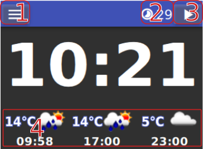

# Graphical User Interface

Here are screenshots and references to interactive widgets.
Items that have a context menu are activated by *press-and-hold*
for a second. Others are directly clickable.
Here are some hints. I recommend you just figure the rest out and find the bugs!

## Main page

-   **1** The 'hamburger' menu

-   **2**  Sleep timer - remaining time until going to standby (only shown when
    playing)\
    **press** resets the timer
    **press-and-hold** opens the sleep-timer context menu.

-   **3**  Player control widget
    **press** shows player controls which will disappear after 3s.

-   **4**  Weather condition and forecasts
    **press-and-hold** updates the weather forecasts

## Alarms

-   **1** Toggle switch enable/disable alarm

-   **2** Delete alarm. *press-and-hold** until bar fills to delete alarm.

-   **3** Alarm entry in list (grey disabled, blue enabled)
    **press-and-hold** on any alarm will show the Alarm edit dialog

-   **4** Create alarm **press** creates alarm and opens Alarm edit dialog

-   **5** Tumbler for alarm time

-   **6** Dropdown for alarm periods

-   **7** Dropdown for radio station to play when alarm is triggered
